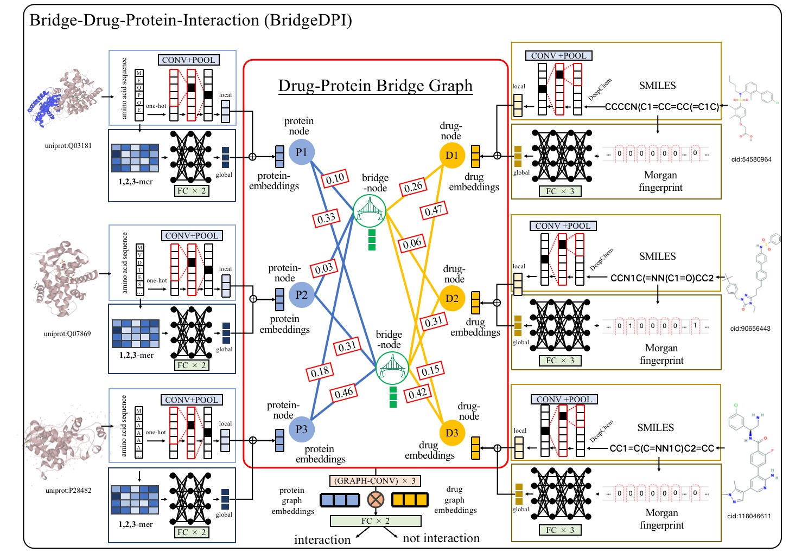

# BridgeDTI 
A Novel Graph Neural Network for Predicting Drug-Protein Interactions. 

### Architecture   


## A demo webserver is available:
http://csuligroup.com:8000/BridgeDPI

# Usage
## How to use it?
Firstly, you need to import the package.
```python
from utils import *
from DL_ClassifierModel import *
```
### 1. How to preprocess the raw data
First, instance the dataClass object and do preprocessing. 

For customized BindingDB dataset: 
```python
dataClass = DataClass(dataPath='path to bdb', 
                      pSeqMaxLen=1024, dSeqMaxLen=128)                       
```
>**dataPath** is the path of the customized BindingDB dataset. 
>**pSeqMaxLen** is the maximum length of protein sequences.
>**dSeqMaxLen** is the maximum length of drug smiles.

For other normal dataset, whose format is like below:
```
drug1 protein1 lab
drug2 protein2 lab
...
```
The class is simiar as before: 
```python
dataClass = DataClass_normal(dataPath='path to txt', 
                             pSeqMaxLen=1024, dSeqMaxLen=128, 
                             sep=' ')                       
```
>**dataPath** is the path of txt file. 
>**pSeqMaxLen** is the maximum length of protein sequences.
>**dSeqMaxLen** is the maximum length of drug smiles.
>**sep** is the separate in a line. It is ' ' or ',',  generally.  

If you need train the embeddings, you can run " ***dataClass.vectorize(amSize=16, atSize=16)*** ".  


## 2. How to train the models. 
Instance the model object and do training. 
```python
model = DTI_Bridge(outSize=128, 
                   cHiddenSizeList=[1024], 
                   fHiddenSizeList=[1024,256], 
                   fSize=1024, cSize=dataClass.pContFeat.shape[1],
                   gcnHiddenSizeList=[128,128], fcHiddenSizeList=[128], nodeNum=64,
                   hdnDropout=0.5, fcDropout=0.5, device=torch.device('cuda'))
model.train(dataClass, trainSize=512, batchSize=512, epoch=128, 
            lr=0.001, stopRounds=-1, earlyStop=30, 
            savePath='BridgeDTI', metrics="AUC", report=["ACC", "AUC", "LOSS"], 
            preheat=0)
```
>**outSize** is the final embedding size of proteins and drugs. 

Also, if you want to train the E2E, E2E/go models, you just need to instance another model class (DTI_E2E, DTI_E2E_nogo, see DL_ClassifierModel.py for more details). 

## 3. How to do prediction
```python
model = DTI_Bridge(...)
model.load(path="xxx.pkl", map_location="cpu", dataClass=dataClass)
model.to_eval_mode()
Ypre,Y = model.calculate_y_prob_by_iterator(dataClass.one_epoch_batch_data_stream(batchSize=128, type='test', device=torch.device('cpu')))
```
>**path** is your model saved path, which is a ".pkl" file. 

The output *Ypre* is your predicted values, *Y* is the true values. 
